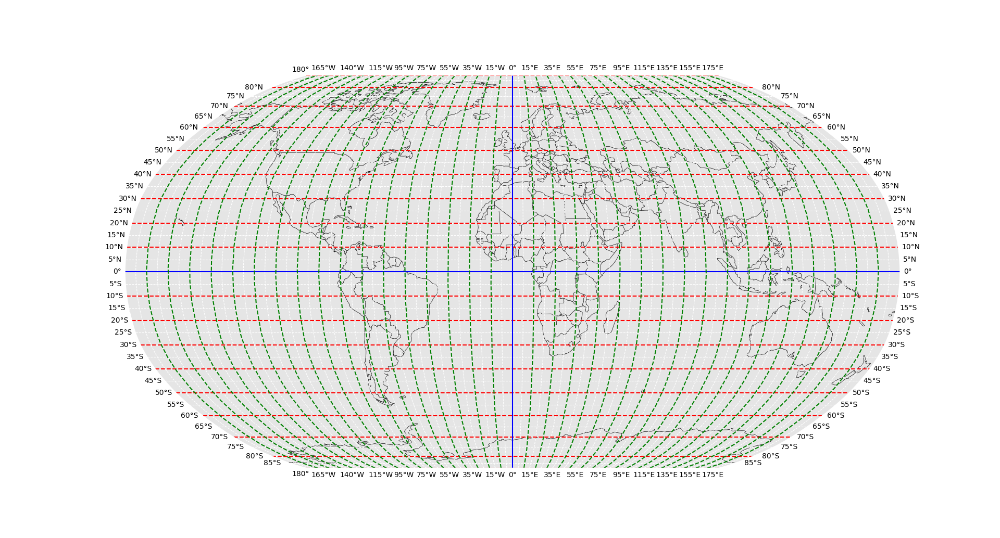

GEO AI
======

The goal of this project is to create a model that can predict the location of a street view panorama based on the image of the panorama.

For simplifying the problem, we will first convert the given latitude and longitude to a simple 2D coordinate system.

> **Note:** since we may want to use different resolution levels [(10 x 10), (100 x 200), ...], we will map the latitude from [-90, 90] to [0, X_SCALE] and the longitude from [-180, 180] to [0, Y_SCALE]
> (where $X_{scale}$ and $Y_{SCALE}$ are constant integers).

The function `f` will map the latitude and longitude to the 2D coordinate system, and the function `inverse_f` will map the 2D coordinate system back to the latitude and longitude.

$$f(a, b) = \\mathopen{}\\left( \left\lfloor  \\frac{\\left\\{ \\begin{array}{ll} a, & \\mathrm{if} \\ a \\ge 0 \\\\ \| a \| + 90, & \\mathrm{otherwise} \\end{array} \\right. \\cdot \\mathrm{X_{SCALE}}}{180} \right\rceil,
\left\lfloor \\frac{\\left\\{ \\begin{array}{ll} b, & \\mathrm{if} \\ b \\ge 0 \\\\ \| b \| + 180, & \\mathrm{otherwise} \\end{array} \\right. \\cdot \\mathrm{Y_{SCALE}}}{360} \\mathclose{}\\right\rceil \\mathclose{}\\right)$$

$$\\mathrm{inverse\\_f}(x, y) = \\mathopen{}\\left( \\left\\{ \\begin{array}{ll} \\frac{x \\cdot 180}{\\mathrm{X\\_SCALE}}, & \\mathrm{if} \\ \\frac{x \\cdot 180}{\\mathrm{X\\_SCALE}} \\le 90 \\\\ \\mathopen{}\\left( \\frac{x \\cdot 180}{\\mathrm{X\\_SCALE}} - 90 \\mathclose{}\\right) \\cdot -1, & \\mathrm{otherwise} \\end{array} \\right., \\left\\{ \\begin{array}{ll} \\frac{y \\cdot 360}{\\mathrm{Y\\_SCALE}}, & \\mathrm{if} \\ \\frac{y \\cdot 360}{\\mathrm{Y\\_SCALE}} \\le 180 \\\\ \\mathopen{}\\left( \\frac{y \\cdot 360}{\\mathrm{Y\\_SCALE}} - 180 \\mathclose{}\\right) \\cdot -1, & \\mathrm{otherwise} \\end{array} \\right. \\mathclose{}\\right)$$

## $[-90, 90] \times [-180, 180] \to [0, (9 \cdot 2)] \times [0, (18 \cdot 2)]$

$$\to$$

simple grid ...

<!--

## Notes:

Swin Transformer: Hierarchical Vision Transformer using Shifted Windows

TinyViT: Fast Pretraining Distillation for Small Vision Transformers

Reinforcement Learning

V-net (V-Net: Fully Convolutional Neural Networks for Volumetric Medical Image Segmentation)

# goal

pred land better than 96%

-->

## Street View Panoramas

> (188K Photospheres from Google Street View from 2007 to 2023)
>
> ### About Dataset
>
>The Streetview Panoramas Dataset is a comprehensive collection of 187,777 streetview photospheres from various locations around the world. This dataset provides researchers, developers, and enthusiasts with a diverse and extensive resource for a wide range of applications such as computer vision, geolocation analysis, urban planning, and virtual reality.
>
>The dataset consists of two main components: a CSV file named "images.csv" and a folder named "images." The CSV file serves as a metadata index for the photospheres, while the "images" folder contains the corresponding photospheres themselves. Each photosphere has a unique identifier (ID) assigned to it.
>
>The "images" folder contains the photospheres, each having a width of 512 pixels (and a variable height). The filenames of the photospheres correspond to their unique IDs, making it easy to establish a connection between the CSV metadata and the actual image files.
>
>This dataset provides an invaluable resource for various research and development tasks, including image classification, object recognition, geospatial analysis, and exploration of urban environments. With its vast collection of street view panoramas, researchers can explore diverse geographical locations and examine changes in urban landscapes over time.
>
> #### Google Streetview/Maps license
>
>https://www.google.com/intl/en-GB_ALL/permissions/geoguidelines/
>
>>
>> see: https://www.kaggle.com/datasets/nikitricky/streetview-photospheres/
>>
